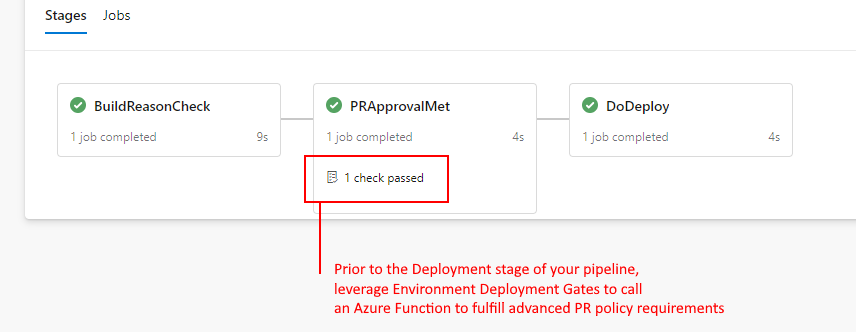

# Azure DevOps Pull Request Policy Checking

When you run pipelines in Azure DevOps as part of a build policy, the selected pipeline will start immediately with the Pull Request.
Often this is the desired behaviour as you want to compile your code and run your unit tests asap, ready for the PR approvers to see.

Sometimes however you won't want;

1. Pipeline logic to run
1. Consumption of pipeline minutes or compute time

Until some of the more basic Pull Request policies have been satisfied (such as Work item association or specific approvers).

Unfortunately this isn't possible for Azure DevOps to accommodate out of the box, as all Pull Request policies (including Build Policies) operate independently.

We therefore need to lean on the Azure DevOps API, to query the Pull Request Policies.
Because we need to reevaluate the PR Policies compliance regularly, this check needs to be initiated on a Serverless agent as part of an Environment gate.

## The Process

You'll need to use an `Environment` as part of your pipeline in order to add a approval check to the pipeline flow.
On the Environment, we'll add an Approval that will run some code to verify the other Pull Request policies have been approved/met.



*Components*
1. A [Sample pipeline file is provided](raw/main/docassets/azure-pipelines.yml), it'll create the Environment stubs for you in Azure DevOps. If you're using your own existing pipeline file, make sure to declare an `Environment`
1. A deployed `Azure Function` (of type PowerShell), which uses [this PowerShell script](https://github.com/Gordonby/AdoGateFunctions/blob/main/ValidatePrFromBuildId/run.ps1). You won't need to change this code, as the variable components will be defined in your Environment Approval Gate.
1. An `Environment approval gate`, defined to call the Azure Function.  A [sample configuration image](docassets/EnvApprovalFunctionConfig.png) is provided in this folder.

## The Azure Function

Environment Approval Gates can be super helpful in providing the right governance for your pipelines, however most of the available gate options are quite limited in their capability. The nature of what we're trying to achieve is a series of checks which can only take place inside an Azure Function or API call. 

`We're limited in the available Azure DevOps variables from the Approval Gates, namely the absence of the PullRequest. We therefore need to begin the process with the most relevant variable that is available, the *BuildId*`

Because of this limitation, we can't use a simpler approval technique to find out the Pull Request Policy adherence... We're going to need to make several API calls, parsing and filtering the responses - so an Azure Function gives us this ability.

### What the Function actually does

1. Take a number of parameters from the Azure DevOps request (namely the BuildId, ProjectId, OrganisationName and optionally the AccessToken)
1. Call the Azure DevOps API to obtain the Build details from the provided BuildId, to obtain the PullRequestId
1. Call the Azure DevOps API to obtain the Pull Request Policy details from the PullRequestId
1. Loop through all the PR Policies to evaluate blocking policies that are not yet approved
1. Respond to the Azure DevOps request with an indicator to proceed, and a list of the Blocking Policies

### Deploying the Function

Use the buttons below to quickly deploy the Azure Function to your Azure Subscription.

| Template  | ARM Template |
|:----------|:-------------|
| Function App | [](https://ms.portal.azure.com/?feature.customportal=false#create/Microsoft.Template/uri/https%3A%2F%2Fraw.githubusercontent.com%2FGordonby%2FSnippets%2Fmaster%2FAzureDevOps%2FPR-Check-Gate%2Farm-deploy-functionapp.json) |
| Resource Group and Function App | [](https://ms.portal.azure.com/?feature.customportal=false#create/Microsoft.Template/uri/https%3A%2F%2Fraw.githubusercontent.com%2FGordonby%2FSnippets%2Fmaster%2FAzureDevOps%2FPR-Check-Gate%2Farm-deploy-functionapp-wResourceGroup.json)|

The [code](https://github.com/Gordonby/AdoGateFunctions) is pulled at deploy time into the FunctionApp.

### Invoking the Azure Function

Inside the Azure DevOps `Environment` you've defined, navigate to Approvals and Checks, and add a new `Invoke Azure Function` check. Provide the URL (eg. https://fnadoextension3abg3z5bvi2p56.azurewebsites.net/api/ValidatePrFromBuildId) and Function Key from your Azure Function (eg. YwTj/W/NR9oBygyXDVlGaO3yAOyw6aEzjaayRKmRZQCUYo23tuIXOA==), select the POST method and provide these values;

Headers
```
{
"Content-Type":"application/json"
}
```

Body
```
{
"URI": "$(System.CollectionUri)", 
"ProjectId": "$(system.TeamProjectId)",
"Project":"$(System.TeamProject)",
"BuildId": "$(Build.BuildId)",
"AuthToken": "$(system.AccessToken)"
}
```

Success Criteria
```
eq(root['prstatus'], 'satisfied')
```

## Security

### ADO Access Token

The Azure Function needs an ADO security access token to communicate with the Azure DevOps API.
The token can be passed to the function by the ADO Approval gate in the HTTP request body, or retrieved from the Azure Function Application Settings, depending on your preference.
The token itself is issued by Azure DevOps, has a limited scope, and the lifetime of the token is short. You can read more about the token here: [https://github.com/Microsoft/azure-pipelines-agent/blob/master/docs/design/auth.md#start-and-listen](https://github.com/Microsoft/azure-pipelines-agent/blob/master/docs/design/auth.md#start-and-listen)

### Azure Function Access

The Azure Function uses a "function level" key to protect itself from being called anonymously. You can read more about this here: [https://docs.microsoft.com/en-us/azure/azure-functions/security-concepts#function-access-keys](https://docs.microsoft.com/en-us/azure/azure-functions/security-concepts#function-access-keys)

### Network

Firstly, Azure DevOps is a SaaS service that is built on Microsoft Azure services and is hosted on the internet.
Azure DevOps calls the Azure Function with a HTTPS request on a public endpoint.

The Azure Function then makes outbound API calls, back to Azure DevOps with a HTTPS request on a public endpoint.

At no point are there dependencies taken on other resources which would originate on your private network, as such the Function App can be isolated from any corporate network connected services you may also run in Azure.

Environment Gate Checks leverage [Agentless jobs](https://docs.microsoft.com/en-us/azure/devops/pipelines/process/phases?view=azure-devops&tabs=yaml#agentless-tasks), which are Microsoft managed and cannot run on a private network.

## Contributing

This project welcomes contributions and suggestions.  Most contributions require you to agree to a
Contributor License Agreement (CLA) declaring that you have the right to, and actually do, grant us
the rights to use your contribution. For details, visit https://cla.opensource.microsoft.com.

When you submit a pull request, a CLA bot will automatically determine whether you need to provide
a CLA and decorate the PR appropriately (e.g., status check, comment). Simply follow the instructions
provided by the bot. You will only need to do this once across all repos using our CLA.

This project has adopted the [Microsoft Open Source Code of Conduct](https://opensource.microsoft.com/codeofconduct/).
For more information see the [Code of Conduct FAQ](https://opensource.microsoft.com/codeofconduct/faq/) or
contact [opencode@microsoft.com](mailto:opencode@microsoft.com) with any additional questions or comments.

## Trademarks

This project may contain trademarks or logos for projects, products, or services. Authorized use of Microsoft 
trademarks or logos is subject to and must follow 
[Microsoft's Trademark & Brand Guidelines](https://www.microsoft.com/en-us/legal/intellectualproperty/trademarks/usage/general).
Use of Microsoft trademarks or logos in modified versions of this project must not cause confusion or imply Microsoft sponsorship.
Any use of third-party trademarks or logos are subject to those third-party's policies.
